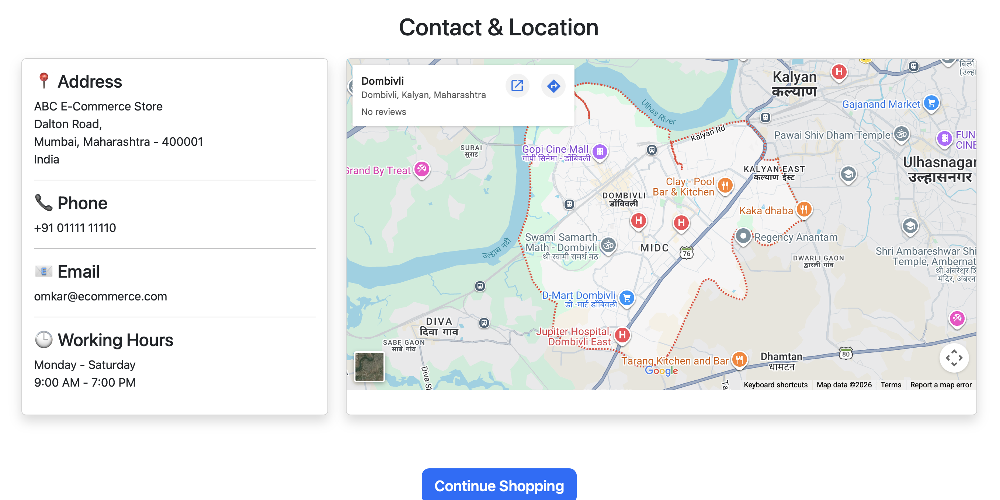

# 🛒 Django E-Commerce Website

A modern **E-Commerce Web Application** built with **Django** that allows users to browse products, manage their shopping cart, place orders, and manage their profiles through a responsive and user-friendly interface.

The project follows Django's **Model-View-Template (MVT)** architecture and demonstrates full-stack web development using **Python, Django, PostgreSQL, Bootstrap, HTML, CSS, and JavaScript**.

---

# ✨ Features

## 👤 User Authentication

- User Registration
- Secure Login & Logout
- Protected User Routes

## 👤 User Profile

- View Profile
- Update Profile
- Upload Profile Picture
- Manage Address Information

## 🛍️ Product Management

- Browse Products
- Product Categories
- Product Details
- Product Images
- Stock Management

## 🛒 Shopping Cart

- Add Products to Cart
- Update Quantity
- Remove Products
- Automatic Subtotal Calculation

## 📦 Order Management

- Place Orders
- View Order History
- Track Order Status

Supported Order Status:

- Pending
- Confirmed
- Shipped
- Delivered
- Cancelled

## 🛠️ Admin Dashboard

- Django Admin Panel
- Manage Categories
- Manage Products
- Manage Orders
- Manage Users
- Update Order Status

## 🎨 User Experience

- Responsive Design
- Bootstrap 5
- Mobile Friendly
- Dark Mode / Light Mode
- Theme Persistence using Local Storage

---

# 🛠️ Tech Stack

| Technology | Purpose |
|------------|----------|
| Python | Programming Language |
| Django 3 | Backend Framework |
| PostgreSQL | Database |
| Django ORM | ORM |
| HTML5 | Markup |
| CSS3 | Styling |
| Bootstrap 5 | Responsive UI |
| JavaScript | Client-side Functionality |

---

# 📂 Project Structure

```text
django-ecommerce/
│
├── cart/
├── ecommerce/
├── media/
├── orders/
├── products/
├── screenshots/
├── static/
│   ├── css/
│   └── js/
├── templates/
├── users/
├── manage.py
├── requirements.txt
├── .env          # Create your own (not included)
├── .gitignore
└── README.md
```

---

# 🗄️ Database

This project uses **PostgreSQL** as the primary database.

Database operations are handled using **Django ORM**.

---

# ⚙️ Prerequisites

Before running the project, make sure you have installed:

- Python 3.x
- PostgreSQL
- Git

---

# 🚀 Installation

## 1. Clone the Repository

```bash
git clone https://github.com/Omi005/Django_E-commerce.git
```

```bash
cd Django_E-commerce
```

---

## 2. Create Virtual Environment

### Windows

```bash
python -m venv venv
```

Activate

```bash
venv\Scripts\activate
```

### macOS / Linux

```bash
python3 -m venv venv
source venv/bin/activate
```

---

## 3. Install Dependencies

```bash
pip install -r requirements.txt
```

---

## 4. Create PostgreSQL Database

Create a PostgreSQL database.

Example:

Database Name

```
ecommerce_db
```

Create a database user and assign the necessary privileges.

---

## 5. Create a `.env` File

Create a file named:

```
.env
```

Add the following:

```env
SECRET_KEY=your_secret_key

DEBUG=True

DB_NAME=ecommerce_db
DB_USER=your_database_user
DB_PASSWORD=your_database_password
DB_HOST=localhost
DB_PORT=5432
```

---

## 6. Apply Database Migrations

```bash
python manage.py migrate
```

---

## 7. Create an Admin User

```bash
python manage.py createsuperuser
```

---

## 8. Run the Development Server

```bash
python manage.py runserver
```

Open your browser:

```
http://127.0.0.1:8000/
```

---

# 📁 Static & Media

The project supports:

- Static CSS
- JavaScript
- Product Images
- User Profile Images

Media files are stored inside:

```
media/
```

---

# 🔐 Authentication

The application uses Django's built-in authentication system.

Features include:

- User Registration
- Login
- Logout
- Profile Management
- Secure Authentication

---

# 🌙 Dark Mode

The application includes:

- Dark Theme
- Light Theme
- Theme Persistence using Local Storage
- Responsive Design

---

# 📸 Screenshots

## 🌙 Home Page (Dark Mode)


---

## ☀️ Home Page (Light Mode)


---

## 👤 User Profile


---

## 🛒 Shopping Cart


---

## 📱 Mobile Layout


---

## ☰ Hamburger Menu


---

## 🛠️ Admin Dashboard


---

## 📍 Location



---

# 🚀 Future Improvements

- Product Search
- Product Filtering
- Wishlist
- Online Payments (Stripe / Razorpay)
- Product Reviews
- Product Ratings
- Coupons
- Email Notifications
- Inventory Analytics
- Sales Dashboard

---

# 💡 Project Highlights

- Django MVT Architecture
- PostgreSQL Database
- Environment Variable Configuration (.env)
- Responsive Bootstrap UI
- Dark / Light Theme
- Django Admin Dashboard
- CRUD Operations
- Authentication & Authorization
- Clean Project Structure

---

# 🤝 Contributing

Contributions are welcome!

1. Fork the repository

2. Create a new branch

```bash
git checkout -b feature-name
```

3. Commit your changes

```bash
git commit -m "Add new feature"
```

4. Push to GitHub

```bash
git push origin feature-name
```

5. Open a Pull Request

---

# 👨‍💻 Author

## Omkar Khedekar

GitHub:

https://github.com/Omi005

---

# 📄 License

This project is created for learning and portfolio purposes.

---

# ⭐ Support

If you found this project helpful, consider giving it a ⭐ on GitHub!