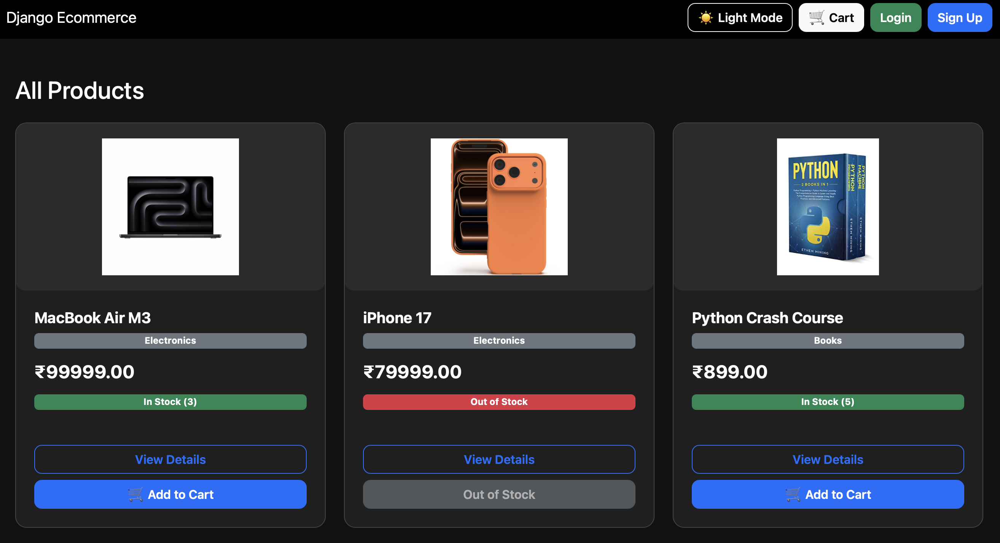
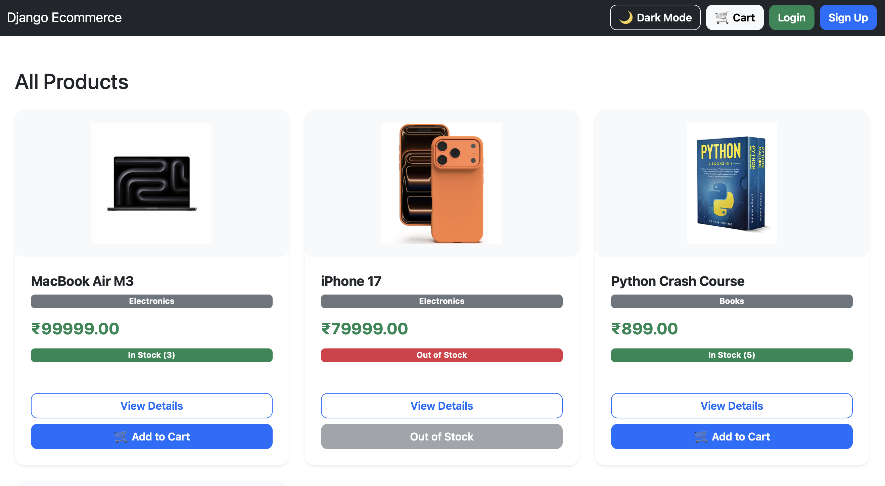
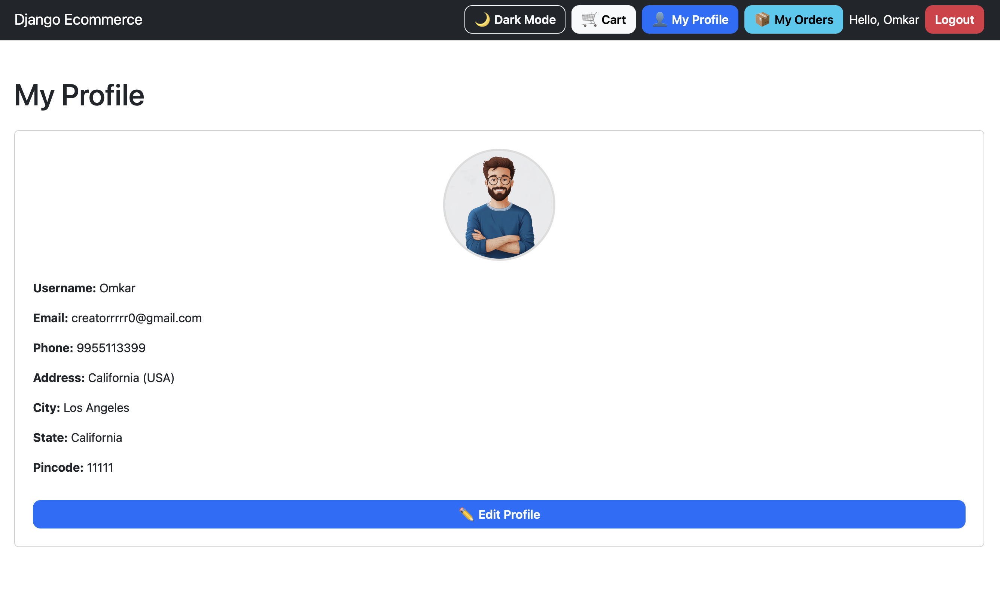
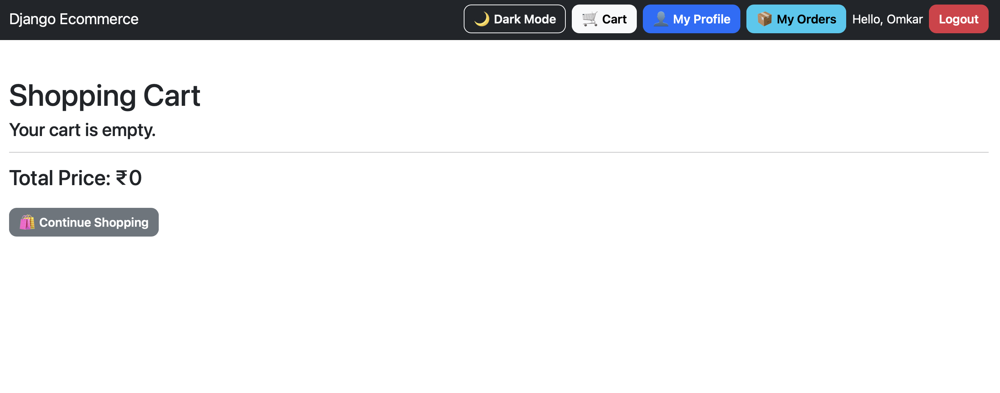
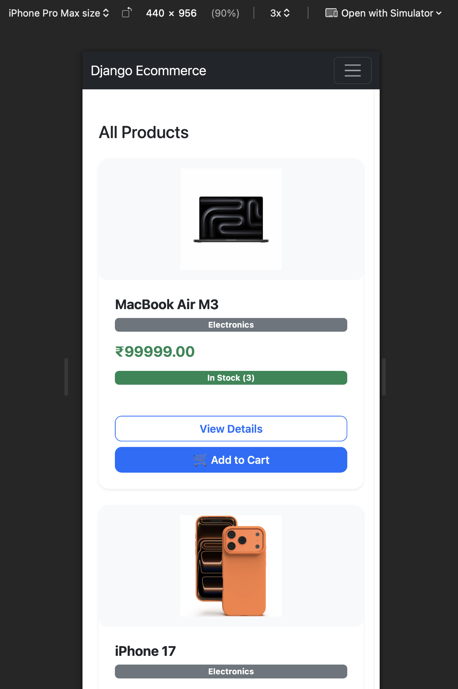
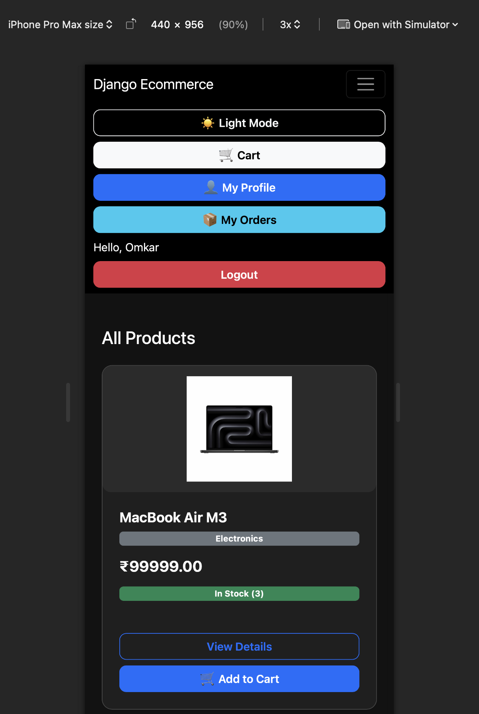
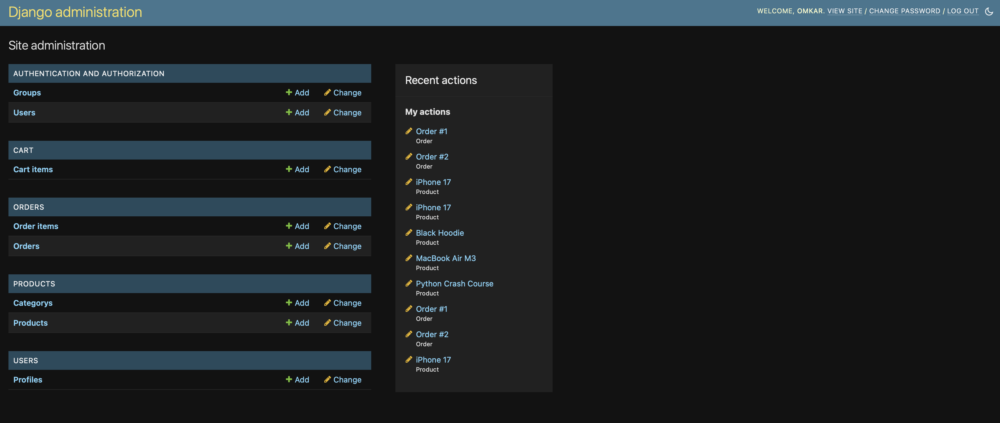

# 🛒 Django E-Commerce Website

A modern **E-Commerce Web Application** built with **Django** that allows users to browse products, manage their shopping cart, place orders, and manage their profiles through a responsive and user-friendly interface.

The application follows Django's **Model-View-Template (MVT)** architecture and demonstrates full-stack web development using Django, Bootstrap, SQLite, HTML, CSS, and JavaScript.

---

## ✨ Features

### 👤 User Authentication
- User Registration
- Secure Login & Logout
- Protected User Routes

### 👤 User Profile
- View & Update Profile
- Upload Profile Picture
- Manage Address Information

### 🛍️ Product Management
- Browse Products
- Product Categories
- Product Images
- Product Details
- Stock Management

### 🛒 Shopping Cart
- Add Products to Cart
- Update Quantity
- Remove Products
- Automatic Subtotal Calculation

### 📦 Order Management
- Place Orders
- View Order History
- Track Order Status

Order Status:
- Pending
- Confirmed
- Shipped
- Delivered
- Cancelled

### 🛠️ Admin Dashboard
- Django Admin Panel
- Manage Categories
- Manage Products
- Manage Orders
- Manage Users
- Update Order Status

### 🎨 User Experience
- Responsive Design
- Bootstrap 5 UI
- Mobile Friendly
- Dark Mode / Light Mode
- Theme Persistence using Local Storage

---

# 🛠️ Tech Stack

| Technology | Purpose |
|------------|----------|
| Python | Programming Language |
| Django 3 | Backend Framework |
| HTML5 | Markup |
| CSS3 | Styling |
| Bootstrap 5 | Responsive Design |
| JavaScript | Client-side Functionality |
| SQLite3 | Database |
| Django ORM | Database Operations |

---

# 📂 Project Structure

```text
django-ecommerce/
│
├── cart/
├── ecommerce/
├── media/
├── orders/
├── products/
├── static/
│   ├── css/
│   └── js/
├── templates/
│   ├── cart/
│   ├── orders/
│   ├── products/
│   └── users/
├── users/
├── manage.py
├── db.sqlite3
└── requirements.txt
```

---

# 🗄️ Database Models

### Users
- Profile
- Address
- Phone Number
- Profile Picture

### Products
- Category
- Product
- Price
- Stock
- Product Image

### Cart
- Cart Item
- Quantity
- Subtotal

### Orders
- Order
- Order Item
- Order Status
- Total Price

---

# ⚙️ Installation

## Clone the Repository

```bash
git clone https://github.com/Omi005/Django_E-commerce 
```

```bash
cd django-ecommerce
```

## Create Virtual Environment

### Windows

```bash
python -m venv venv
```

Activate

```bash
venv\Scripts\activate
```

### Linux/macOS

```bash
python3 -m venv venv
source venv/bin/activate
```

---

## Install Dependencies

```bash
pip install -r requirements.txt
```

---

## Apply Migrations

```bash
python manage.py makemigrations
python manage.py migrate
```

---

## Create Admin User

```bash
python manage.py createsuperuser
```

---

## Run the Project

```bash
python manage.py runserver
```

Open your browser and visit:

```
http://127.0.0.1:8000/
```

---

# 📁 Static & Media

The project supports:

- Static CSS
- JavaScript
- Product Images
- Profile Images

Media files are stored in the **media/** directory.

---

# 🔐 Authentication

The application uses Django's built-in Authentication System.

Features include:

- User Registration
- Login
- Logout
- Profile Management
- Secure Authentication

---

# 🌙 Dark Mode

The application includes a Dark/Light theme with:

- One-click Toggle
- Persistent Theme using Local Storage
- Responsive Design

---

# 📸 Screenshots


## 🌙 Home Page (Dark Mode)



## ☀️ Home Page (Light Mode)



## 👤 User Profile



## 🛒 Shopping Cart



## 📱 Mobile Layout



## ☰ Hamburger Menu



## 🛠️ Admin Dashboard




---

# 🚀 Future Improvements

- Product Search
- Product Filtering
- Wishlist
- Online Payments (Stripe/Razorpay)
- Product Reviews
- Ratings
- Coupons
- Email Notifications
- Inventory Analytics
- Sales Dashboard

---

# 🤝 Contributing

Contributions are welcome.

1. Fork the repository
2. Create a new branch

```bash
git checkout -b feature-name
```

3. Commit your changes

```bash
git commit -m "Added new feature"
```

4. Push

```bash
git push origin feature-name
```

5. Open a Pull Request

---

# 👨‍💻 Author

## Omkar

GitHub:
https://github.com/Omi005

---

## ⭐ Support

If you found this project helpful, consider giving it a ⭐ on GitHub!