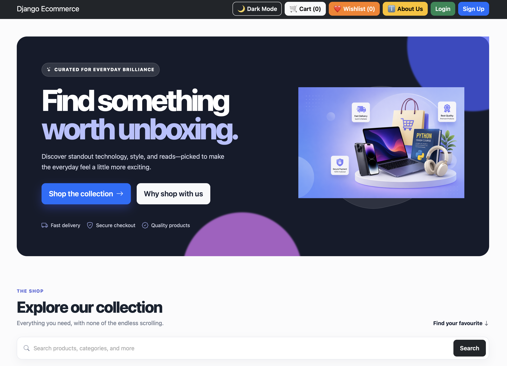
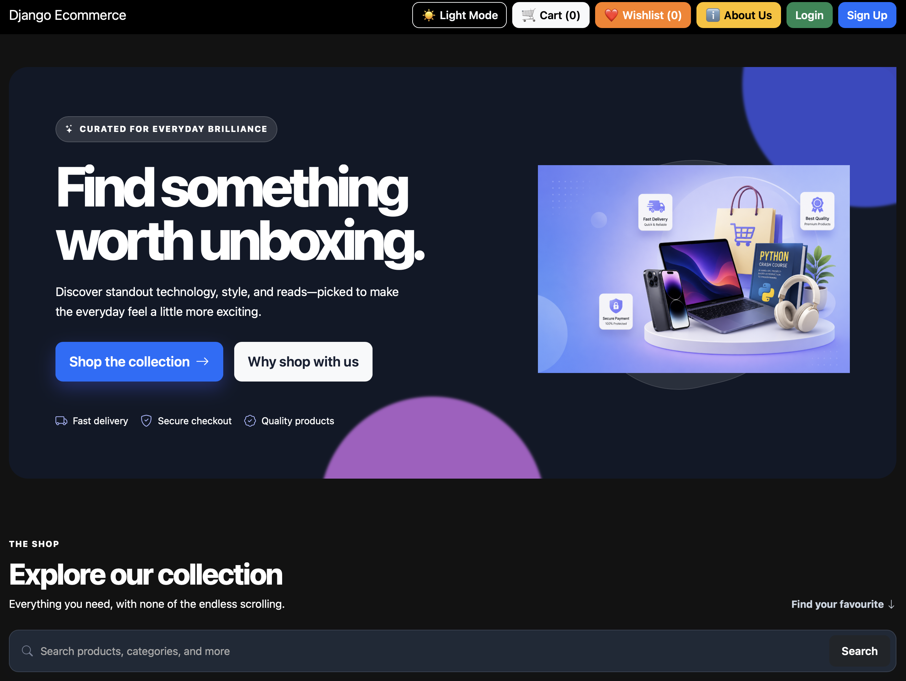
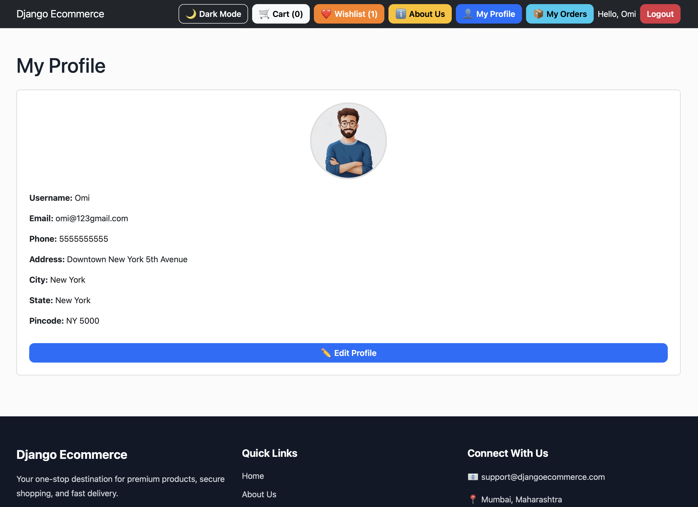
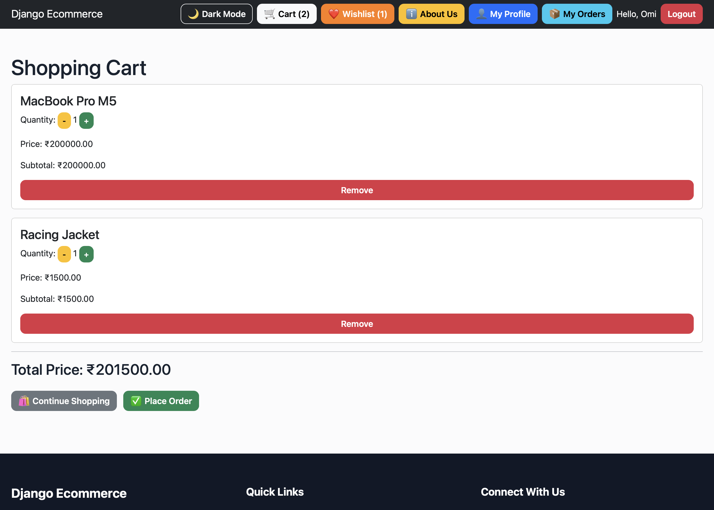
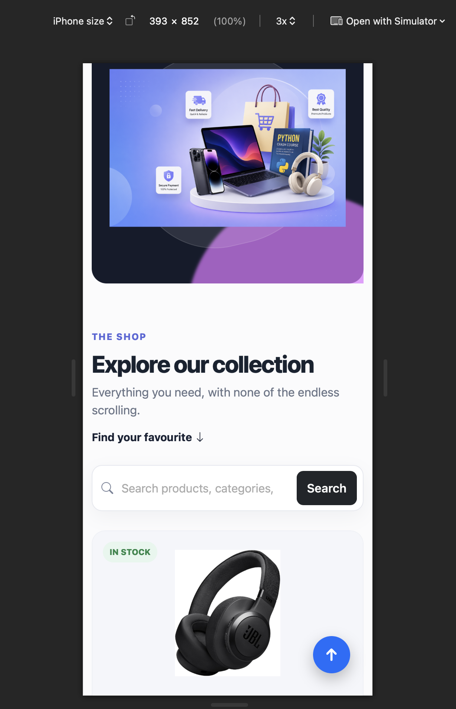
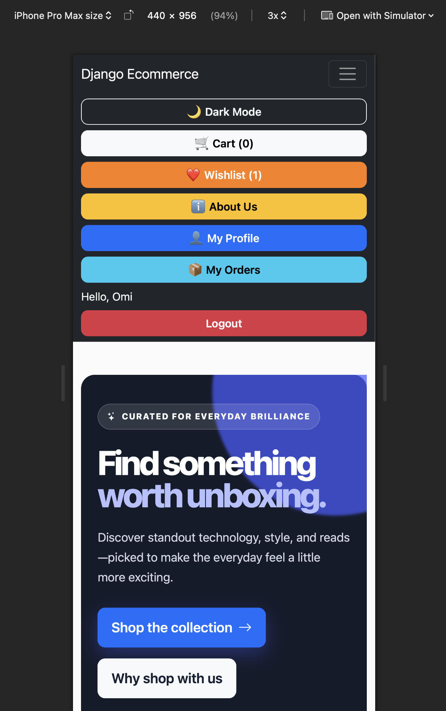
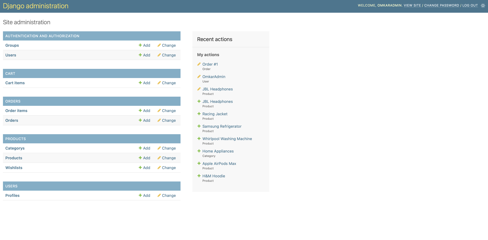
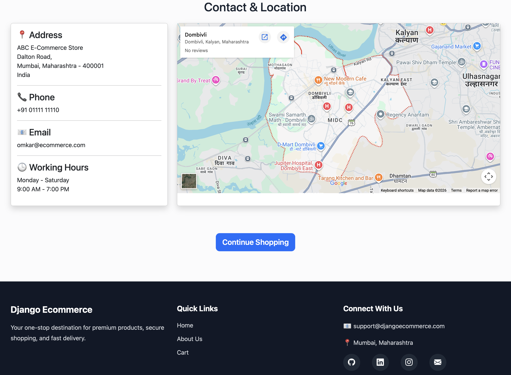

# 🛒 Django E-Commerce Website

A modern **E-Commerce Web Application** built with **Django** that allows users to browse products, manage their shopping cart, place orders, and manage their profiles through a responsive and user-friendly interface.

The project follows Django's **Model-View-Template (MVT)** architecture and demonstrates full-stack web development using **Python, Django, PostgreSQL, Bootstrap, HTML, CSS, and JavaScript**.

Users can search the catalogue, save products to a wishlist, manage their cart, place and cancel eligible orders, and download PDF invoices. Store administrators can manage products, stock, customers, and order statuses through Django Admin.

---

# ✨ Features

## 👤 User Authentication

- User Registration
- Secure Login & Logout
- Protected User Routes
- Automatic profile creation for new users

## 👤 User Profile

- View Profile
- Update Profile
- Upload Profile Picture
- Manage Address Information

## 🛍️ Product Management

- Browse Products
- Product Categories
- Product Details
- Product Images
- Stock Management
- Search by product name, description, or category
- Wishlist with add and remove actions

## 🛒 Shopping Cart

- Add Products to Cart
- Update Quantity
- Remove Products
- Automatic Subtotal Calculation
- Cart item count in the navigation bar
- Stock-aware quantity limits and out-of-stock messaging

---

## 📦 Order Management

- Place Cash on Delivery (COD) Orders
- Order Success Page
- View Order History
- View Order Details
- Track Order Status
- Cancel Pending or Confirmed Orders
- Download PDF Invoices
- Download Invoice directly from the Order Success page
- Automatic stock reduction after successful order placement

Supported Order Status:

- Pending
- Confirmed
- Shipped
- Delivered
- Cancelled

---

## 🛠️ Admin Dashboard

- Django Admin Panel
- Manage Categories
- Manage Products
- Manage Orders
- Manage Users
- Update Order Status
- Manage wishlists, cart items, customer profiles, and profile images

---

## 🎨 User Experience

- Responsive Design
- Bootstrap 5
- Mobile Friendly
- Dark Mode / Light Mode
- Theme Persistence using Local Storage
- Polished storefront hero, product search, responsive product grid, and back-to-top control

---

# 🛠️ Tech Stack

| Technology | Purpose |
|------------|----------|
| Python | Programming Language |
| Django 4.2 | Backend Framework |
| PostgreSQL | Database |
| Django ORM | ORM |
| HTML5 | Markup |
| CSS3 | Styling |
| Bootstrap 5 | Responsive UI |
| JavaScript | Client-side Functionality |
| Pillow | Product and profile image handling |
| ReportLab | PDF invoice generation |
| python-dotenv | Environment variable configuration |

---

# 📂 Project Structure

```text
django-ecommerce/
│
├── cart/
│   ├── models.py         # User cart items and quantities
│   └── views.py          # Cart management
├── ecommerce/
│   ├── settings.py       # Project and database configuration
│   └── urls.py           # Root URL configuration
├── media/
│   ├── products/         # Uploaded product images
│   └── profile_pics/     # User profile images
├── orders/
│   ├── models.py         # Orders and order items
│   └── views.py          # Ordering, cancellation, and invoices
├── products/
│   ├── models.py         # Categories, products, and wishlists
│   └── views.py          # Catalogue, search, and wishlist actions
├── screenshots/
├── static/
│   ├── css/
│   └── js/
├── templates/            # Shared, product, cart, order, and user pages
├── users/                # Authentication and user profile management
├── manage.py
├── requirements.txt
├── .env          # Create your own (not included)
├── .gitignore
└── README.md
```

---

# 🗄️ Database

This project uses **PostgreSQL** as the primary database.

Database operations are handled using **Django ORM**.

---

# ⚙️ Prerequisites

Before running the project, make sure you have installed:

- Python 3.x
- PostgreSQL
- Git

---

# 🚀 Installation

## 1. Clone the Repository

```bash
git clone https://github.com/Omi005/Django_E-commerce.git
```

```bash
cd Django_E-commerce
```

---

## 2. Create Virtual Environment

### Windows

```bash
python -m venv venv
```

Activate

```bash
venv\Scripts\activate
```

### macOS / Linux

```bash
python3 -m venv venv
source venv/bin/activate
```

---

## 3. Install Dependencies

```bash
pip install -r requirements.txt
```

---

## 4. Create PostgreSQL Database

Create a PostgreSQL database.

Example:

Database Name

```
ecommerce_db
```

Create a database user and assign the necessary privileges.

---

## 5. Create a `.env` File

Create a file named:

```
.env
```

Add the following:

```env
SECRET_KEY=your_secret_key

DEBUG=True

DB_NAME=ecommerce_db
DB_USER=your_database_user
DB_PASSWORD=your_database_password
DB_HOST=localhost
DB_PORT=5432
```

---

## 6. Apply Database Migrations

```bash
python manage.py migrate
```

---

## 7. Create an Admin User

```bash
python manage.py createsuperuser
```

---

## 8. Run the Development Server

```bash
python manage.py runserver
```

Open your browser:

```
http://127.0.0.1:8000/
```

---

# 📁 Static & Media

The project supports:

- Static CSS
- JavaScript
- Product Images
- User Profile Images
- PDF invoices generated on demand (not stored as media files)

Media files are stored inside:

```
media/
```

---

# 🔐 Authentication

The application uses Django's built-in authentication system.

Features include:

- User Registration
- Login
- Logout
- Profile Management
- Secure Authentication

All cart, wishlist, profile, and order-history pages require an authenticated user.

---

# 📦 Orders & Invoices

Customers can place orders using **Cash on Delivery (COD)**.

When an order is placed:

- Stock is automatically reduced
- Cart items are converted into order items
- The shopping cart is cleared
- An order confirmation page is displayed

Customers can then:

- View their complete order history
- Open individual order details
- Track order status (`Pending`, `Confirmed`, `Shipped`, `Delivered`, `Cancelled`)
- Cancel orders that are still pending or confirmed
- Download a computer-generated PDF invoice from both the Order Success page and Order Details page

---

# 🌙 Dark Mode

The application includes:

- Dark Theme
- Light Theme
- Theme Persistence using Local Storage
- Responsive Design

---

# 📸 Screenshots

## 🌙 Home Page (Light Mode)



---

## ☀️ Home Page (Dark Mode)



---

## 👤 User Profile



---

## 🛒 Shopping Cart



---

## 📱 Mobile Layout



---

## ☰ Hamburger Menu



---

## 🛠️ Admin Dashboard



---

## 📍 Location



---

# 🚀 Future Improvements

- Online Payment Integration (Stripe / Razorpay)
- Product Filtering
- Product Reviews
- Product Ratings
- Coupons & Discounts
- Email Notifications
- Shipment Tracking
- Returns & Refund Workflow
- Inventory Analytics
- Sales Dashboard
- Automated Tests
- Production Deployment

---

# 💡 Project Highlights

- Django MVT Architecture
- PostgreSQL Database
- Environment Variable Configuration (.env)
- Responsive Bootstrap 5 UI
- Dark / Light Theme
- Django Admin Dashboard
- CRUD Operations
- Authentication & Authorization
- Product Search
- Wishlist
- Shopping Cart
- Cash on Delivery Checkout
- Order History & Order Details
- Order Cancellation
- PDF Invoice Generation
- Automatic Stock Management
- Responsive Storefront
- Clean Project Structure

---

# 🤝 Contributing

Contributions are welcome!

1. Fork the repository

2. Create a new branch

```bash
git checkout -b feature-name
```

3. Commit your changes

```bash
git commit -m "Add new feature"
```

4. Push to GitHub

```bash
git push origin feature-name
```

5. Open a Pull Request

---

# 👨‍💻 Author

## Omkar Khedekar

GitHub:

https://github.com/Omi005

---

# 📄 License

This project is created for learning and portfolio purposes.

---

# ⭐ Support

If you found this project helpful, consider giving it a ⭐ on GitHub!
